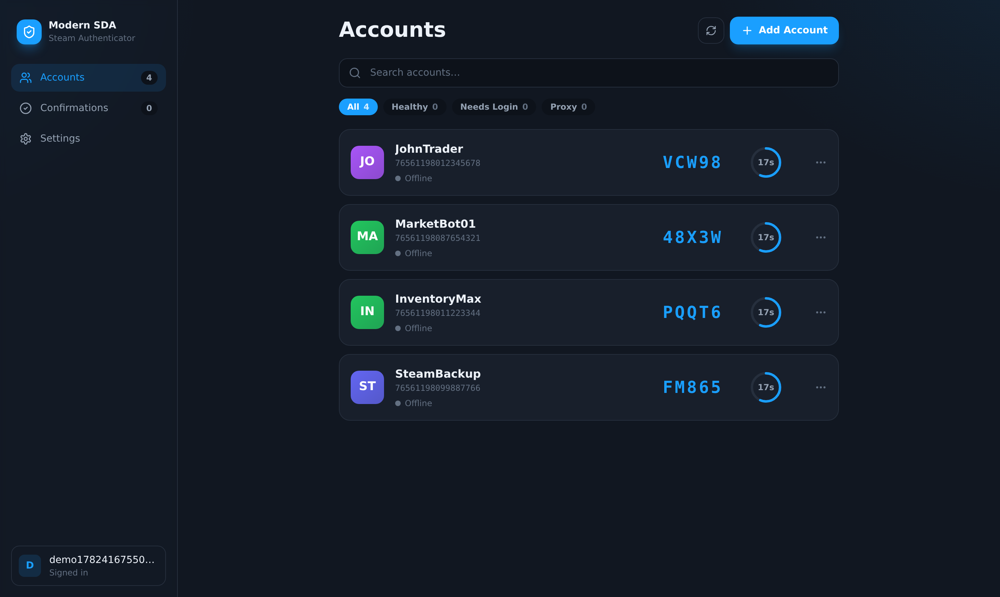

<div align="center">

# 🛡️ Modern SDA Web

**A fast, modern, multi-user Steam Desktop Authenticator for your browser.**

Generate Steam Guard codes, approve trade & market confirmations, and approve
QR logins — for all your accounts, from any device — with every secret sealed by
strong encryption.

A web port of [Modern-SDA](https://github.com/HouwyTwitch/Modern-SDA) (desktop)
and [Modern-SDA-Android](https://github.com/HouwyTwitch/Modern-SDA-Android).

</div>



---

## ✨ Features

- 👤 **Multi-user** — each person signs in and manages their own private set of Steam accounts.
- 🆕 **Create new authenticators** — enroll Steam Guard on an account and generate a `.maFile` (SteamAuth logic).
- 🔑 **Live Steam Guard codes** — rotating every 30s with animated countdown rings.
- 🔄 **Live confirmations** — view, approve, decline, and bulk-accept trade & market confirmations.
- 📷 **QR login approval** — approve a Steam "sign in with QR" by pasting/scanning the QR image or link.
- 🪪 **Refresh-token sessions** — sign in to Steam once; the session is reused and refreshed automatically.
- 🌐 **Per-account proxy** support.
- 🎨 **Polished, responsive UI** — light/dark/contrast themes, accent colors, desktop + mobile layouts.
- 🔐 **Strong security** — see [Security](#-security).

## 🚀 Quick start

You only need to install **[Python 3.10+](https://www.python.org/downloads/)** and
**[Node.js 18+](https://nodejs.org)** once. Then:

### Windows
> Double-click **`run.bat`**

### macOS / Linux
```bash
./run.sh
```

The launcher sets everything up the first time (a minute or two), then opens
**http://localhost:8000** in your browser. Subsequent launches are instant.

### Docker (only Docker required)
```bash
docker compose up --build
```
Then open **http://localhost:8000**.

> First time here? Read the **[Installation Guide](docs/INSTALL.md)** for
> step-by-step instructions (including how to install Python and Node), and the
> **[User Guide](docs/USER_GUIDE.md)** to learn how to add accounts and approve
> confirmations.

## 📚 Documentation

| Guide | What's inside |
| ----- | ------------- |
| **[Installation](docs/INSTALL.md)** | Prerequisites, Windows/macOS/Linux/Docker setup, updating |
| **[User Guide](docs/USER_GUIDE.md)** | Register, import `.maFile`, sign in to Steam, confirmations, QR, settings |
| **[Security](docs/SECURITY.md)** | The full security model and threat considerations |
| **[Deployment](docs/DEPLOYMENT.md)** | Hosting for others, environment variables, HTTPS, backups |
| **[Troubleshooting](docs/TROUBLESHOOTING.md)** | Common problems and fixes |

## 🔐 Security

Defence in depth, in layers:

1. **Your password never leaves the browser in the clear** — it's hashed client-side
   (PBKDF2-SHA256) and only the hash is sent.
2. **Encrypted application channel** — on top of HTTPS, every request/response body is
   encrypted with a per-request AES-256-GCM key wrapped under the server's RSA key.
3. **Envelope-encrypted vault at rest** — each account's secrets are sealed with a random
   data key (AES-256-GCM) that is wrapped twice: once with your password-derived key
   (scrypt) and once with the server master key. They're decryptable **only by you or the
   server**, never by anyone with just the database.

Plus per-account ownership checks (no IDOR), brute-force rate limiting, strict input
validation, and constant-time password comparison. Codes are generated server-side and
your secrets are never sent to the browser unless you explicitly reveal them.

Full details in **[docs/SECURITY.md](docs/SECURITY.md)**.

> ⚠️ Use this only with Steam accounts you own. Keep backups of your `.maFile`s — losing
> your authenticator secret can lock you out of Steam.

## 🧱 Tech stack

| Layer | Tech |
| ----- | ---- |
| Frontend | React 18 · TypeScript · Vite · Tailwind CSS · Zustand · jsQR |
| Backend | Python · FastAPI · SQLAlchemy 2 (async) + SQLite · PyJWT · `cryptography` |
| Steam | `aiosteampy` (auth, refresh tokens, confirmations) |

In production the FastAPI backend serves the built UI, so the whole app runs as a single
service on one port.

## 🗂️ Project structure

```
.
├─ run.bat / run.sh          one-command launchers
├─ scripts/launch.py         cross-platform setup + run
├─ Dockerfile / compose      container build (UI + API)
├─ src/                      React frontend
│  ├─ components/ pages/ store/ hooks/ lib/
├─ server/                   FastAPI backend
│  ├─ main.py                routes
│  ├─ vault.py               envelope encryption
│  ├─ server_crypto.py       RSA channel keys
│  ├─ crypto_mw.py           encrypted-channel middleware
│  ├─ steam_service.py       aiosteampy integration + QR approval
│  ├─ steam_guard.py         Steam Guard code algorithm
│  └─ static_site.py         serves the built UI
└─ docs/                     documentation
```

## 🛠️ Development

Run the frontend and backend separately with hot-reload:

```bash
# terminal 1 — backend (http://localhost:8000)
cd server && python -m venv .venv && source .venv/bin/activate
pip install -r requirements.txt
uvicorn main:app --reload --port 8000

# terminal 2 — frontend (http://localhost:5173, proxies /api to the backend)
npm install
npm run dev
```

See [docs/DEPLOYMENT.md](docs/DEPLOYMENT.md) for production hosting.

## 📄 License

[MIT](LICENSE)
